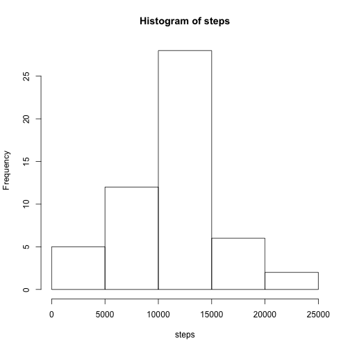
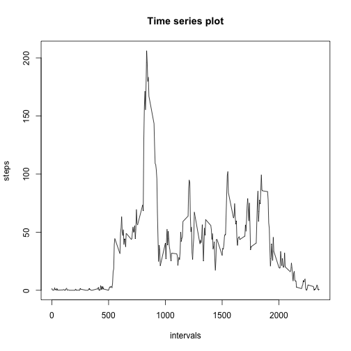
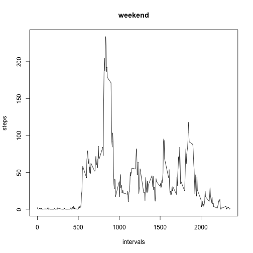

RepData_PeerAssessment1
=======================
## Loading and preprocessing the data


```r
data <- read.csv("activity.csv")
```


## What is mean total number of steps taken per day?

### Histogram of the total number of steps taken each day:


```r
d <- data[rowSums(is.na(data)) == 0, ]
dates <- unique(d$date)
steps <- c()
for (arg in dates) {
    steps <- c(steps, sum(d[d$date == arg, ]$steps[!is.na(d[d$date == arg, ]$steps)]))
}

hist(steps)
```

 


### Mean total number of steps taken per day:

```r
mean(steps)
```

```
## [1] 10766
```

### Median total number of steps taken per day:

```r
median(steps)
```

```
## [1] 10765
```


## What is the average daily activity pattern?

### Time series plot of the 5-minute interval (x-axis) and the average number of steps taken, averaged across all days (y-axis)


```r
intervals <- unique(d$interval)
steps2 <- c()
for (arg in intervals) {
    steps2 <- c(steps2, mean(d[d$interval == arg, ]$steps[!is.na(d[d$interval == 
        arg, ]$steps)]))
}
plot(intervals, steps2, type = "l", ylab = "steps", main = "Time series plot")
```

 


### The 5-minute interval that contains the maximum number of steps:

```r
temp <- cbind(intervals, steps2)
temp[order(-temp[, 2]), ][1]
```

```
## [1] 835
```


## Imputing missing values

### Calculate and report the total number of missing values in the dataset


```r
length(data$steps) - length(d$steps)
```

```
## [1] 2304
```


### Devise a strategy for filling in all of the missing values in the dataset
Strategy: Using the mean for that 5-minute interval to fill in missing value

### Create a new dataset that is equal to the original dataset but with the missing data filled in.


```r
names(steps2) <- intervals
steps3 <- data$steps
intervals3 <- data$intervals
for (i in 1:length(steps3)) {
    if (is.na(steps3[[i]])) 
        steps3[[i]] <- steps2[toString(intervals3[[i]])]
}
data2 <- data
data2$steps <- steps3
```


### New histogram of the total number of steps taken each day:


```r
dates <- unique(d$date)
steps <- c()
for (arg in dates) {
    steps <- c(steps, sum(d[d$date == arg, ]$steps[!is.na(d[d$date == arg, ]$steps)]))
}

hist(steps)
```

 


### New mean total number of steps taken per day:

```r
mean(steps)
```

```
## [1] 10766
```

### New median total number of steps taken per day:

```r
median(steps)
```

```
## [1] 10765
```


### Do these values differ from the estimates from the first part of the assignment? 
No
### What is the impact of imputing missing data on the estimates of the total daily number of steps?
If you use the mean for that 5-minute interval to fill in missing value, nothing changes.

## Are there differences in activity patterns between weekdays and weekends?

### Create a new factor variable in the dataset with two levels – “weekday” and “weekend” indicating whether a given date is a weekday or weekend day.


```r
weekday <- c()
for (day in data2$date) {
    weekday <- c(weekday, weekdays(as.Date(day)))
}
for (i in 1:length(weekday)) {
    if (weekday[i] %in% c("Sunday", "Saturday")) {
        weekday[i] <- "weekend"
    } else {
        weekday[i] <- "weekday"
    }
}
data2$weekday <- weekday
```


### Time series plot


```r

d <- data2
intervals <- unique(data2$interval)
steps2a <- c()
steps2b <- c()
d2a <- d[d$weekday == "weekday", ]
d2b <- d[d$weekday == "weekend", ]
for (arg in intervals) {
    steps2a <- c(steps2a, mean(d2a[d2a$interval == arg, ]$steps[!is.na(d2a[d2a$interval == 
        arg, ]$steps)]))
}
for (arg in intervals) {
    steps2b <- c(steps2b, mean(d2b[d2b$interval == arg, ]$steps[!is.na(d2b[d2b$interval == 
        arg, ]$steps)]))
}

plot(intervals, steps2a, type = "l", ylab = "steps", main = "weekday")
```

 

```r

plot(intervals, steps2a, type = "l", ylab = "steps", main = "weekend")
```

 

```r

```

